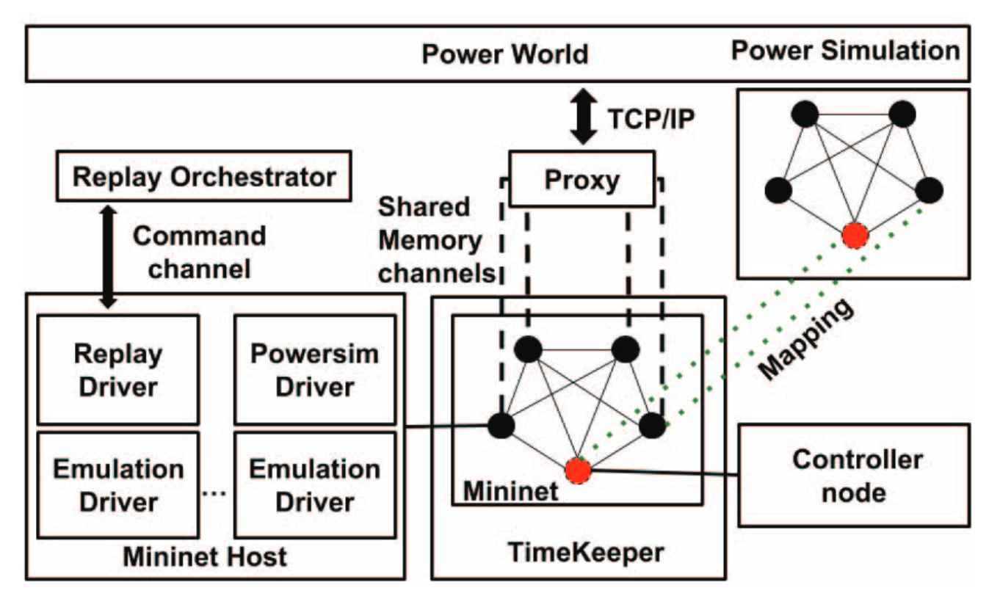

About
=====

Melody is a dataset generation tool for the modern power grid.  Melody synthesizes network traffic for scalable systems, modeling both the cyber and physical components of the smart grid. It utilizes virtual time to generate traffic with high fidelity from a simulated physical network integrated with an emulated cyber network. 

