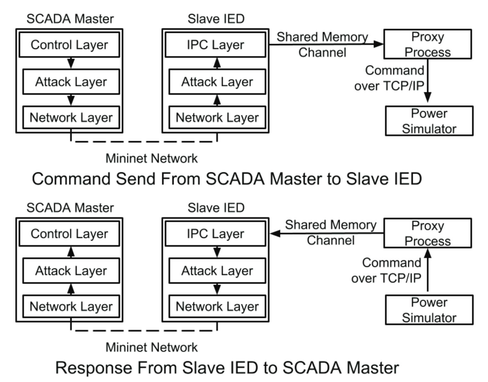

About
============

Melody is a dataset generation tool for the modern power grid. Melody synthesizes network traffic for scalable systems, modeling both the cyber and physical components of the smart grid. It utilizes virtual time to generate traffic with high fidelity from a simulated physical network integrated with an emulated cyber network. 

Motivation
------------------

As control devices become increasingly prevalent in smart grid systems, the detection and prevention of attacks on these devices also become more critical, since attacks focused on the inherent security vulnerabilities of these devices could result in catastrophic failures. Machine learning based Network Intrusion Detection Systems (NIDS) seek to identify such attacks, but in order to do so, they rely on learning the normal traffic patterns of the system in question and subsequently finding anomalies in future network traffic. Due to associated security risks and operational resource constraints, this type of system network traffic data is not readily available for research purposes. Melody provides a framework for synthesizing these types of datasets.

Researchers can utilize Melody to generate both normal background network traffic and attack traffic in a modeled smart grid control network. Melody synthesizes high temporal fidelity datasets using a virtual time system that allows for fine-grained control over the execution of the system processes. Adversarial traffic is embedded within background traffic via emulation and traffic replay mechanisms. Melody has been evaluated to demonstrate that its synthesized datasets have temporal characteristics analogous to data obtained from a real network. Melody has the capability to generate datasets representing networks containing thousands of simultaneous flows while maintaining temporal and causal fidelity.

Architecture
------------------

Smart grid communication networks typically use a two-layered architecture containing a corporate network and a fieldbus/control network. The corporate network handles IT management, operator control, and the storage and analysis of process control data. The control network consists of a topology of controllers and field devices interconnected through multiple switches.

.. image:: images/case_study_cyber_topology.png
  :alt: Smart Grid Communication Network Diagram
  :width: 80%
  :align: center

Melody uses Mininet to emulate the communication network and Matpower to simulate the electrical behavior of the power grid. A proxy process provides an interface between the power simulator and the network emulator. Control commands originate from an emulated control node (e.g. a SCADA master) and are routed through the emulated network to the destination host (e.g an RTU controlling a circuit breaker). These commands are later transferred from this destination host to the power simulator via the proxy. The power simulator calculates the updated system state and sends out responses (e.g. voltage magnitude and angle measurements) which are re-routed back to the control node. 

  
.. image:: images/melody_architecture.png
  :alt: Melody Architecture Diagram
  :width: 80%
  :align: center
  
Each emulated host may run three types of driver processes:

- Emulation Driver: produces traffic by spawning processes that interact with each other
- Replay Driver: initiates traffic replay actions at designated times
- Powersim Driver: conveys power simulation state data across the cyber network to and from the proxy process; spawns the following three threads

    - application layer thread: emulates smart grid applications (IPC layer)
    - attack layer thread: intercepts, modifies, and injects application level packets
    - network layer thread: handles packet transmissions and receptions

Melody supports emulation of traffic with actual processes spawned on mininet hosts by emulation drivers. These processes may be spawned by the emulation drivers at specified offsets of time from the start of the experiment, and may follow one of three different timing patterns. Melody generates packets either by emulating actual production software when possible or by embedding packet traces collected from arbitrary networks in the modelled network.

<Virtual Time Discussion?>

