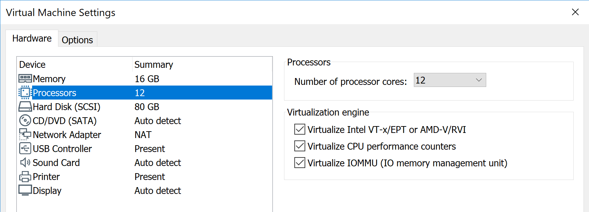

Installation
============

Minimum System Requirements
^^^^^^^^^^^^^^^^^^^^^^^^^^^

Melody and Kronos have been tested on Ubuntu 16.04.5 LTS. Kronos uses a modified linux kernel v4.4.50 patch. The system should consist of an Intel i5 or later processor with atleast 4 cores and 8 GB of RAM for good performance. It is preferable to install Kronos and Melody inside a VM with Virtualized Intel-VTx and CPU performance counters. This is known to avoid display driver issues on newer laptops/machines.

  
  Virtualization Settings required for virtual machine in VMware.

Installtion assumes default python on the system is version 3.6 or higher.

Installing Kronos
^^^^^^^^^^^^^^^^^

To get started on Kronos, please perform the following setup steps:

* Disable Transparent HugePages: (Add the following to /etc/rc.local to permanently disable them)::

    if test -f /sys/kernel/mm/transparent_hugepage/enabled; then
      echo never > /sys/kernel/mm/transparent_hugepage/enabled
    fi
    if test -f /sys/kernel/mm/transparent_hugepage/defrag; then
      echo never > /sys/kernel/mm/transparent_hugepage/defrag
    fi
* Ensure that /etc/rc.local has execute permissions::

    sudo chmod +x /etc/rc.local

* Clone Repository into /home/${user} directory. Checkout the master branch (v1.2)::

    git clone https://github.com/Vignesh2208/Kronos.git

* Compile and configure Kronos kernel patch::
 
    cd ~/Kronos 
    sudo make setup_kernel

  During the setup process do not allow kexec tools to handle kernel reboots.
  Over the course of kernel setup, a menu config would appear. 

  The following additional config steps should also be performed inside menuconfig:

  1. Under General setup 
		     -->  Append a local kernel version name. (e.g it could be "-ins-VT")
		     
		     .. figure:: images/kernel_config_local_version.png
  			:alt: Kernel Configuration Screenshot for Local Version
  			:width: 80%
  			:align: center
  
  #. Under kernel_hacking 
		     --> enable Collect kernel timers statistics
		     
		     .. figure:: images/kernel_config_kernel_timers.png
  			:alt: Kernel Configuration Screenshot for Kernel Timers
  			:width: 80%
  			:align: center
		     
  #. Under Processor types and features 
                     --> Transparent Huge Page support 
                                                      --> Transparent Huge Page support sysfs defaults should be set to always
						      
		     .. figure:: images/kernel_config_transparent_hugepage_support.png
  			:alt: Kernel Configuration Screenshot for Transparent Huge Page Support
  			:width: 80%
  			:align: center	      

* Reboot the machine and into the new kernel (identifiable by the appended local kernel version name in the previous step)

* Build and load Kronos module::
 
    cd ~/Kronos
    sudo make build load

Verifying Installation
----------------------

The following tests (optional) can be run to verify the Kronos installation:

* INS-SCHED specific test::
    
    cd ~/Kronos/src/tracer/tests
    sudo make run_repeatability_test

* Kronos integration tests::

    cd ~/Kronos/test
    sudo make run

All of the above tests should print a SUCCESS message.

Loading Kronos
^^^^^^^^^^^^^^

Inorder to use Kronos, it must be loaded after being built and after each VM/machine reboot. It can be loaded with the following command::

  cd ~/Kronos
  sudo make load

Installing Melody
^^^^^^^^^^^^^^^^^
Melody depends on the following packages and tools:

* python-httplib2
* python-ryu
* numpy
* pypcapfile
* openssh-server
* dpkt 
* mininet
* openvswitch-2.4.0
* protobuf && protoc version >= 3.7
* grpcio and grpcio tools
* Kronos
* Matpower

It may be installed before/after Kronos installation. Please follow the steps given below to download and install melody and its dependencies. It is preferable to install Melody in the /home/${user} directory::

  cd ~/ 
  git clone https://github.com/Vignesh2208/Melody.git
  cd ~/Melody
  sudo ./install_deps.sh
  sudo python setup.py install

Melody Post-Installation Steps
------------------------------

* Setting up python path::
  
    # Add the following to ~/.bashrc
    export PYTHONPATH="${PYTHONPATH}:<path-to-melody>"
    export PYTHONPATH="${PYTHONPATH}:<path-to-melody>/src"
    export PYTHONPATH="${PYTHONPATH}:/home/kronos/Melody/srcs/proto"

    
    # Update .bashrc
    source ~/.bashrc

    # Do the following
    sudo visudo
      
    # Append this line
    Defaults env_keep += "PYTHONPATH"

* Install Matpower by following instructions listed `here`_.

.. _here: https://github.com/MATPOWER/matpower/blob/master/README.md

  Note that it is recommended to install the development version of Matpower by cloning from the github repository, and then run the install_matpower script using Octave. When prompted to select from the MATPOWER Installation Options, choose the following:
    
    	+------------------------------------------------------------------------+
  	| 3. DO modify the Octave path, and SAVE the updated path                |
	|        (so you will not have to do it again next time you run Octave)  |
	+------------------------------------------------------------------------+
	
    	.. figure:: images/octave_matpower_installation.png
  		:alt: Screenshot of Matpower Installation using Octave
  		:width: 80%
  		:align: center

* Install protoc (optional) by following these `instructions`_. Protoc can be used for development if the defined protos are to be changed and compiled. Use version >= 3.7.

.. _instructions: http://google.github.io/proto-lens/installing-protoc.html

* After installation of Melody, please reboot the VM/machine

Ready to use VM
^^^^^^^^^^^^^^^

Link to a ready to use Kronos VM (version 1.3) can be downloaded from `here <https://drive.google.com/drive/folders/1wwJ6tO7XaGj3C_8ZophNsmbc2vO-oxH4?usp=sharing>`_.
The VM also contains installations of companion projects `OpenSCADA <http://github.com/Vignesh2208/OpenSCADA>`_ and `Melody <http://github.com/Vignesh2208/Melody>`_.
which use Kronos for cyber-physical system modelling.

Username: kronos
Password: kronos

Make sure Kronos is loaded after each reboot before running experiments which use it::

  cd ~/Kronos
  sudo make load
  
